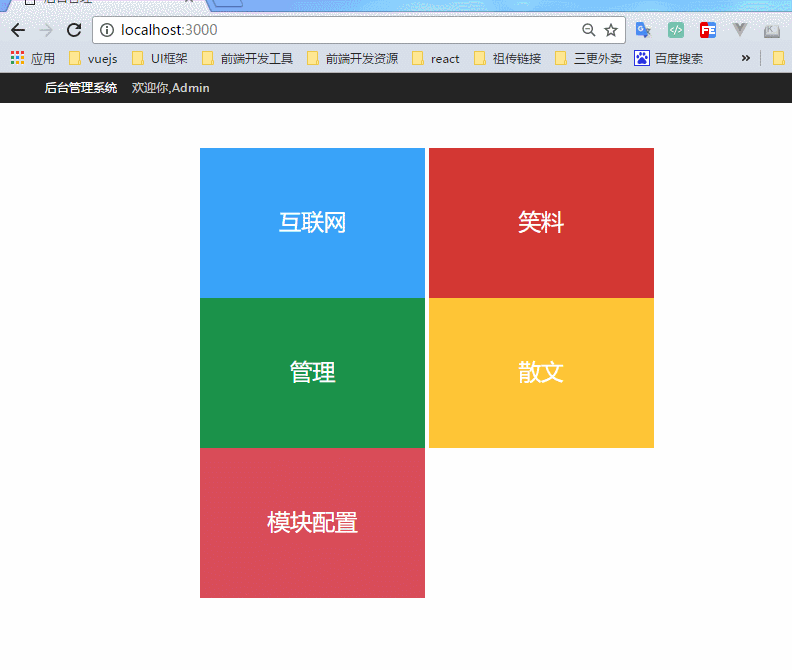
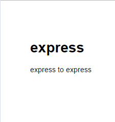
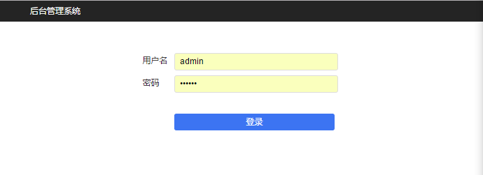
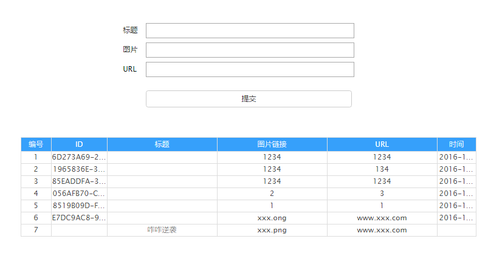

# 使用node.js + express开发简易后台
### 开发环境node.js + express
## [源码](https://github.com/peng1992/express)
## 项目预览


## 复制项目
```
# 将项目克隆到本地
    git clone https://github.com/peng1992/express.git
# 安装项目依赖
    cnpm install
# 启动项目
    cnpm start
```
    
## 然后在浏览器中打开[http://localhost:3000/]( http://localhost:3000/) 网址就可以看到这个应用了


## 项目目录
* bin/
    + www   -------------------------项目入口文件
* node_modules/   -------------------项目依赖文件夹，cnpm intall后生成 
* public/   
    + data/  ------------------------json数据   
    + images/   ---------------------图片
    + js/   -------------------------js文件       
    + stylesheets/  -----------------css文件
* routes/   -------------------------路由配置文件夹
    + data.js   
    + index.js  
* views/    -------------------------模板文件
    + edit.ejs    
    + error.ejs
    + index.ejs
    + login.ejs
    + tujian.ejs
* app.js   --------------------------存放的Express项目中最基本的配置信息
* package.json   --------------------项目依赖文件
            
## 文件解析
### app.js
	// 引入资源文件
	var express = require('express');
    var path = require('path');
    var favicon = require('serve-favicon');
    var logger = require('morgan');
    var cookieParser = require('cookie-parser');
    var bodyParser = require('body-parser');

    var index = require('./routes/index');  ---------------------------引入index.js路由配置文件
    var data = require('./routes/data');    ---------------------------引入data.js路由配置文件

    var app = express();    -------------------------------------------用express创建一个app应用

    // 视图引擎设置
    app.set('views', path.join(__dirname, 'views'));    ---------------指定视图文件夹 views/
    app.set('view engine', 'ejs');  -----------------------------------指定视图引擎 ejs

    // 使用刚刚加载的资源
    //app.use(favicon(path.join(__dirname, 'public', 'favicon.ico')));
    app.use(logger('dev'));
    app.use(bodyParser.json());
    app.use(bodyParser.urlencoded({ extended: false }));
    app.use(cookieParser());    --------------------------------------- 使用cookie
    app.use(express.static(path.join(__dirname, 'public')));    -----------指定公共资源文件夹 为public/

    app.use('/', index);    ----------------------------当路径为'/'，即'http://localhost:3000/'时，匹配index.js
    app.use('/data', data);     ------------------------当路径为'/data',即'http://localhost:3000/data'时，匹配data.js
    // 匹配404，即路径未匹配时
    app.use(function(req, res, next) {
      var err = new Error('Not Found');
      err.status = 404;
      next(err);
    });

    // 当路径匹配错误时
    app.use(function(err, req, res, next) {
      // set locals, only providing error in development
      res.locals.message = err.message;
      res.locals.error = req.app.get('env') === 'development' ? err : {};

      // render the error page
      res.status(err.status || 500);
      res.render('error');
    });

    module.exports = app;

### index.js页面定义的接口如下：(全部为get请求)
* /    -----------------------首页
* /edit?type=it    -----------------------------互联网
* /edit?type=cookies   ---------------------笑料
* /edit?type=manager   --------------------管理
* /edit?type=sanwen    ----------------------散文
* /tuijian -------------------------------------推荐

#### index.js是怎样定义这些接口呢？
	router.get('/edit', function(req, res, next) {...}
以'/edit'为url的ajax请求，就会执行上面的回调函数，让我们来看一下回调函数里面都写了些什么？

	router.get('/edit', function(req, res, next) {
          if(!req.cookies.user){    ---------------------------判断用户是否已登录
              return res.render('login',{});
          }
          var type = req.query.type;    ----------------------获取查询参数type的值
          if(type){ ---------------------------如果查询参数存在
            var obj = {};
            switch(type){   ---------------------------------根据不同的type，返回不同的值
              case 'sanwen':
                obj = {};
                break;
              case 'it':
                obj = {};
                break;
              case 'manager':
                obj = {};
                break;
              case 'cookies':
                obj = {};
                break;
              default :
                    return res.send({
                      status:0,
                      info:'参数错误'
                    });
              break;
            }
            fs.readFile(PATH + type + '.json', (err, data) => { ------------------------------ 读取文件，并执行回调函数              if (err) {
              if (err) {    ---------------------------------如果读取失败
                return res.send({
                  status:0, ---------------------------------返回错误状态码0
                  info: 'fail.....'
                });
              }

              var obj = JSON.parse(data.toString());
              return res.render('edit', {   ----------否则，如果读取成功，渲染模板edit.jsp，返回数据obj
                data: obj
              });
            });
          }else {   -------------------------------------------如果查询参数不存在
            return res.send({
              status:0,
              info: '参数错误'
            });
          }
        });

#### 打开[http://localhost:3000/edit?type=it](http://localhost:3000/edit?type=it)，会提示需要登录，
####用户登录接口[/login](http://localhost:3000/login)，在data.js中设置，账号admin密码12345，登录成功后，会出现如下界面

### data.js定义的接口
* 读数据接口---get请求
    + /write?type=it  ------------------------------------读取it.json中的数据
    + /write?type=cookies
    + /write?type=manager
    + /write?type=sanwen
    + /write?type=tuijian

* 写入数据接口----post请求
    + /write?type=it  ------------------------------------向it.json写入数据
    + /write?type=cookies
    + /write?type=manager
    + /write?type=sanwen
    + /write?type=tuijian

* 阅读模块写入数据接口----post请求
	+ /write_config

* 登录接口----post请求
	+ /login

#### 以写入数据接口为例，'/write?type=it'会执行下面的代码

		router.post('/write',function(req, res, next){
            if(!req.cookies.user){  ------------------------判断是否已登录
                return res.render('login',{});
            }
            // 文件名
            var type = req.param('type') || ""; -------------------------获取请求参数type的值
            // 关键字段
            var url = req.param('url') || '';   -------------------------获取请求参数url的值
            var title = req.param('title') || '';   ---------------------获取请求参数title的值            var img = req.param('img') || '';
            if(!type || !url || !title || !img){    ---------------------如果这些请求参数有一个不存在
                return res.send({
                    status:0,
                    info:'提交的字段不全'
                });
            }
            //1)读取文件
            var filePath = PATH + type + '.json';   --------------------否则，会读取对应的json文件
            fs.readFile(filePath, function(err, data){
                if(err){    --------------------------如果读取数据失败
                    return res.send({   --------------返回错误状态信息
                        status:0,
                        info: '读取数据失败'
                    });
                }
                            ------------------------如果读取数据成功，则继续执行
                var arr = JSON.parse(data.toString());  ----------------------将json文件中的数据取出来，以便待会写入
                //代表每一条记录
                var obj = {     ----------------------待写入的数据
                    img: img,
                    url: url,
                    title: title,
                    id: guidGenerate(), ---------------------数据的id
                    time: new Date()    ---------------------时间戳
                };
                arr.splice(0, 0, obj);  ------------------------在arr数组中插入数据
                //2)写入文件
                var newData = JSON.stringify(arr);
                fs.writeFile(filePath, newData, function(err){  -------------------------将newData写入filePath对应的文件
                    if(err){    -----------------如果写入文件失败
                        return res.send({   --------------------返回错误状态信息
                            status:0,
                            info: '写入文件失败'
                        });
                    }
                    return res.send({   ------------------------如果成功，返回正确状态信息
                        status:1,
                        info: obj
                    });
                });
            });
        });
#### 测试一下，这个接口是否正确
	  $.ajax({
           type: 'POST',
           url: '/data/write',
           data: {
                type: 'it',
                title: '测试标题',
                url: 'www.xxx.com',
                img: 'www.xxx.com/images/xxx.png'
           },
           success: function(data){
               if(data.status){
                   alert('添加数据成功');
               }else{
                   alert('添加失败');
               }
           },
           error: function(){
               alert('添加失败');
           },
           dataType: 'json'
      });
#### 打开public/data/it.json，会发现多了一条数据,说明数据输入接口是ok的
##### it.json
      [
        {
          "img": "www.xxx.com",
          "url": "www.xxx.com/images/xxx.png",
          "title": "测试标题",
          "id": "25478B43-C814-4499-9AF5-2BB010F98099",
          "time": "2016-11-24T14:17:23.659Z"
        }
      ]

## 至此，一个简单的后台接口就完成了
