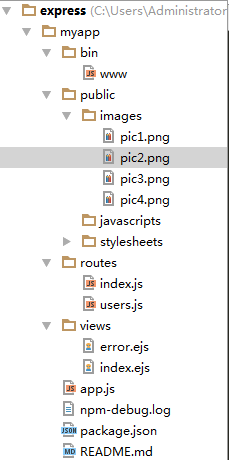

# 使用node.js开发后台
> 开发环境node.js + express

### 创建一个package.json文件
	cnpm init
## 安装express并将其保存在依赖列表中
	cnpm install express --save

## 安装express-generator应用生成器
	cnpm install express-generator -g
	express -h ----------------------------列出express所有的命令行选项

## 生成应用骨架
	express -e myapp---------------------------创建一个命名为app的应用,-e 是基于ejs模版
## 通过express生成的目录文件通常是这样的


	cd myapp--------------------------------进入myapp目录
	cnpm install-----------------------------安装依赖
## 启动应用
	cnmp start-------------------------------启动，启动命令可在package.json文件中"scripts"中设置

## 然后在浏览器中打开[http://localhost:3000/]( http://localhost:3000/) 网址就可以看到这个应用了，如果出现以下内容，说明启动成功了


[在线DOM]()


```
# 安装开发依赖
cnpm/npm install

# 运行
cnpm/npm run dev
# 打包
cnpm run build
```
